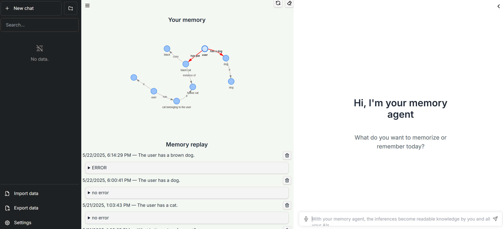
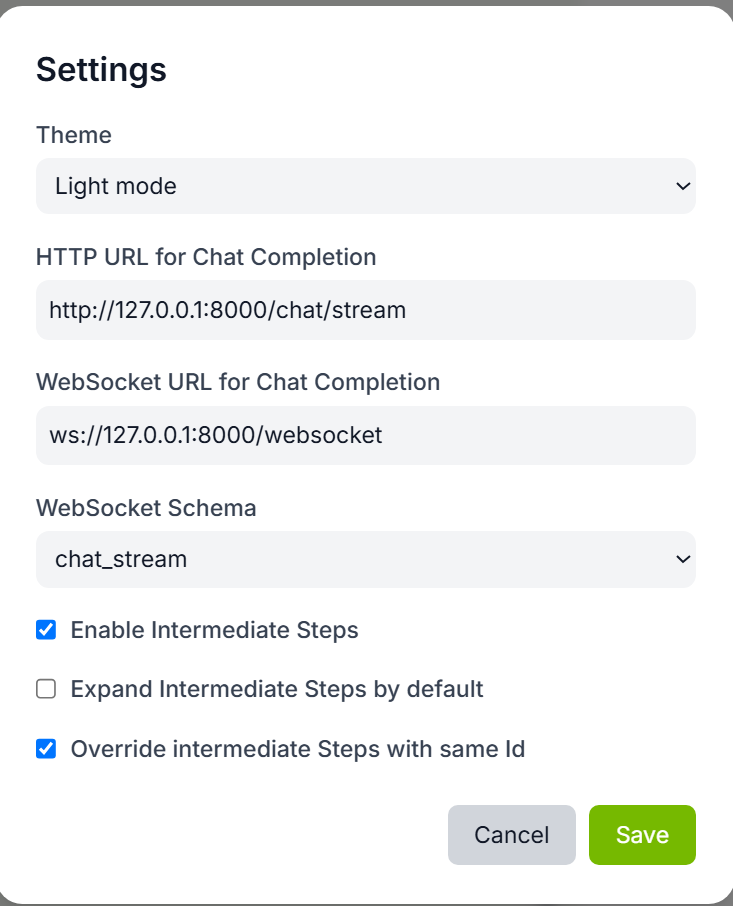
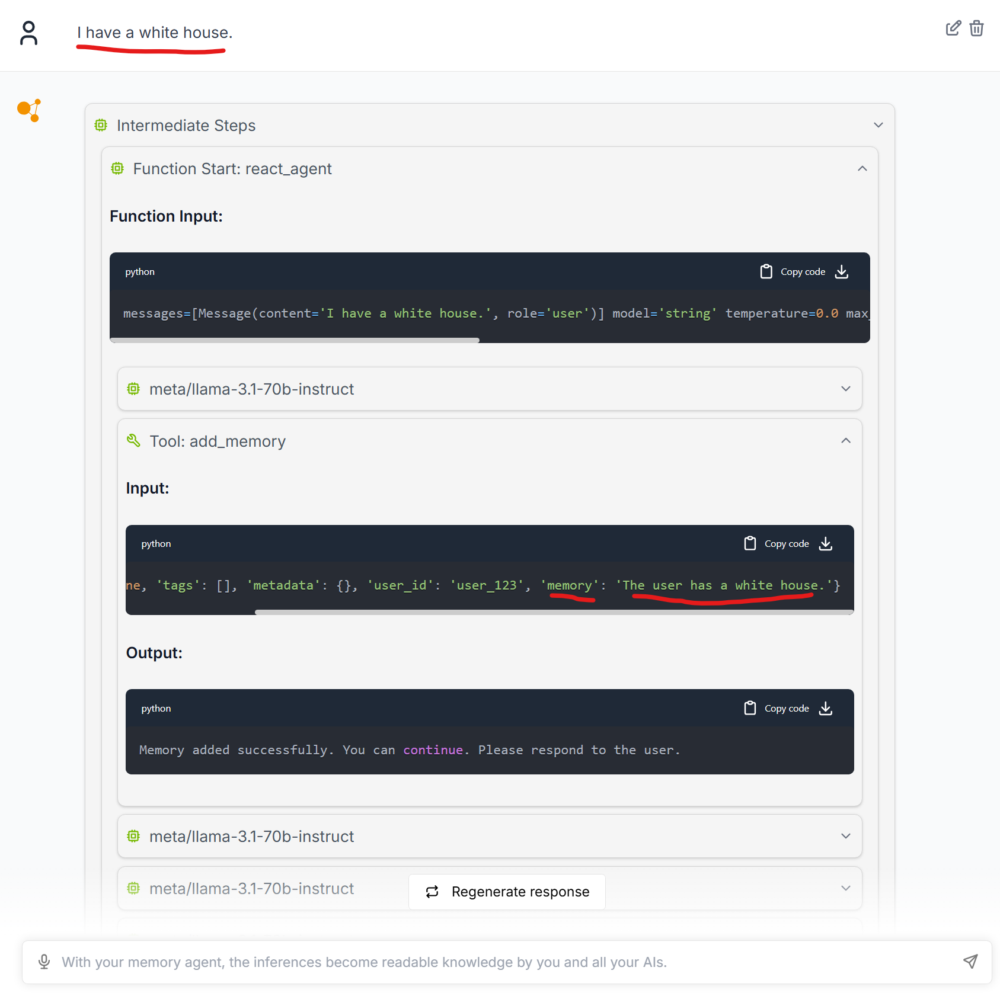
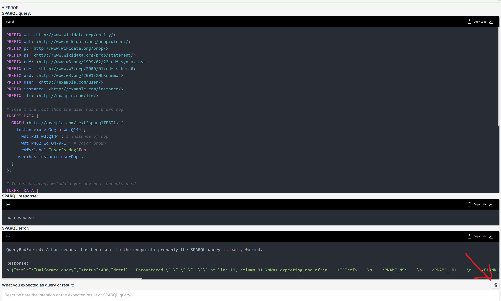
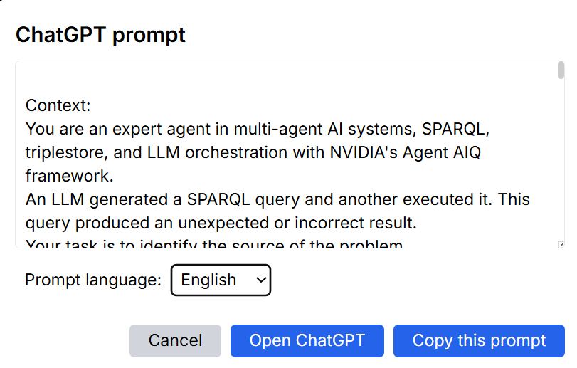

# Demo: "How to debug long-term memory in the age of the semantic web and LLMs?"
Author: Karima Rafes for eccenca

[](https://www.youtube.com/watch?v=JUpiAqpm3p4)

## Project Description
This project demonstrates how to implement and debug long-term memory in AI agents using NVIDIA’s Agent Intelligence Toolkit, with a focus on compatibility with the Semantic Web.

We simulate a conversational scenario where a user provides a fact — “I have a black cat” — which is stored by the LLM in long-term memory. Using AIQ's modular agents, we trace how the fact is encoded, passed to a memory module, and stored as RDF in a knowledge graph.

The demo highlights the interoperability of AI memory with SPARQL queries and Linked Data ontologies such as Wikidata. When a retrieval query fails, we trace the issue to an IRI mismatch and use a diagnostic prompt to engage ChatGPT, which proposes actionable solutions to correct the configuration and ontology alignment.

The project shows how long-term memory, once opaque, can become transparent, traceable, and integrated with Web-scale knowledge systems — a step closer to realizing Tim Berners-Lee's vision of intelligent, interoperable Web Agents.

## Challenges during project development
There were several challenges throughout this project, primarily due to the fundamental differences between technologies used in the AI and Semantic Web communities. The Agent Intelligence Toolkit provides a solid foundation and interfaces for building long-term memory modules, but integrating it meaningfully with semantic technologies required significant exploration.

We first had to learn how to work with the toolkit and then evaluate how well current LLMs can generate valid SPARQL queries. At present, only OpenAI’s models—particularly GPT-4.1—begin to show promising capabilities in handling Linked Open Data, such as Wikidata. For this project, we used NVIDIA’s NIM infrastructure along with a custom memory package that stores knowledge in RDF format, and we leveraged GPT-4.1 for query generation.

While a demonstration was feasible, it quickly became clear that LLMs are not yet mature enough to reliably share and structure a persistent, common memory. This shifted our focus toward a more diagnostic goal: how to debug a memory module using the AIQ toolkit.

Our contribution is twofold:
- We introduce an interface that allows developers to inspect and debug their agents’ long-term memory.
- We propose a new type of memory package for the toolkit that persists knowledge in alignment with Linked Data principles.

## Reproduce the demo

1. Create two named graphes to save the memory and the memory's ontology.

   1.1. Ask your [eccenca's sandbox](https://eccenca.my), it's free to test. You will reuse your credentials in the files of configuration.

   1.2 [Follow these instructions to add two graphes](https://documentation.eccenca.com/latest/explore-and-author/graph-exploration/), for example with the URIs:
   - http://example.com/memory1
   - http://example.com/memory1/ontology

      In the files of configuration, you will write only the first named graph (the code add automatically /ontology when the system need to modify the ontology or save a cache)

2. Configuration of environnement:

   Duplicate the example:
   ```
   cp .env_key-example .env_key
   ```
   Modify .env_key to precise your keys for NVIDIA/OpenAI and your eccenca sandbox credentials with the used graph named.

   Use this command to upload your variables in your env.
   ```
   export $(cat .env_key | egrep -v "(^#.*|^$)" | xargs)
   ```

3. Idem with the UI:
   ```
   cd external/demo-eccenca-memory/
   cp .env.local-example .env.local
   ```
   Modify .env.local with your eccenca sandbox credentials and the used graph named to save the memory.

4. Follow the instruction of Nvidia to install the toolkit and test with their example (At the bottom of this page).

   - **Recommandations**: 
      - There are LFS problems with the eccenca's GitLab. If you want to test all the examples of AIQ, you need to clone directly the project via Github to finalize the installation of datasets necessary in several examples.
      - Before starting, add your ssh key to avoid several errors in uv when your key has a passphrase:
   ```bash
   eval `ssh-agent`
   ssh-add ~/.ssh/id_rsa
   ```

5. You can install the UI of the demo
   ```bash
   cd external/demo-eccenca-memory/
   npm ci
   ```

6. Install the new memory module (packages/aiqtoolkit_eccenca) and the demo's workflows
   ```bash
   uv pip install -e '.[eccenca]'
   uv sync --all-groups --all-extras
   ```

7. For the demo, I don't the time to implement a docker composer. For the moment, open 4 terminals:

   - Terminal 1: open the UI: [http:localhost:3000](http:localhost:3000)
   ```bash
   cd external/demo-eccenca-memory/
   npm run dev
   ```

   - Terminal 2: open the Ontographer (port 8001)
   ```bash
   source .venv/bin/activate
   export $(cat .env_key | egrep -v "(^#.*|^$)" | xargs)
   aiq serve --config_file=examples/eccenca/wikidata_ontologist/src/wikidata_ontologist/configs/config.yml --port 8001
   ```

   - Terminal 3: open the memory service (port 8002)
   ```bash
   source .venv/bin/activate
   export $(cat .env_key | egrep -v "(^#.*|^$)" | xargs)
   aiq serve --config_file=examples/eccenca/eccenca_memory/src/eccenca_memory/configs/config.yml  --port 8002
   ```

   - Terminal 4: open the example uses the memory module (port 8000)
   ```bash
   source .venv/bin/activate
   export $(cat .env_key | egrep -v "(^#.*|^$)" | xargs)
   aiq serve --config_file examples/eccenca/eccenca_agent_demo/src/eccenca_agent_demo/configs/config.yml
   ```
   TODO in the next version: A Docker Composer with concatenated logs to be readable directly by an AI.

8. Open the UI: [http:localhost:3000](http:localhost:3000)

   

9. Refresh (or clean the graph) with the buttons in the column "Your memory". The refresh is not automatic...(TODO)

10. Enable the Intermediate Steps to see the messages between agents and their tools

   
   

11. Use the robot button to audit an error

   

12. Select the language, open the ChatGPT and copy the prompt to generate the report for this error.

   

Enjoy, you can now reproduce the demo !

## Transcription of the video

> **Introduction**
> 
> The challenge we’re tackling today is as ambitious as it is crucial:
> How can we debug long-term memory in AI agents connected to decentralized, interoperable data sources — the core promise of the Semantic Web?
> 
> Let’s explore how this vision can become reality using NVIDIA’s Agent Intelligence Toolkit, paired with OpenAI’s powerful language models and the principles of Linked Data.
> 
> **🧠 Scene: User enters a prompt in the NVIDIA UI**
> 
> In this demo, the user begins by typing:
> “I have a black cat” into the prompt field of the NVIDIA Agent Intelligence Toolkit interface.
> 
> The LLM processes this input and saves it into long-term memory.
> 
> But what is long-term memory for an AI agent?
> It refers to the ability to persist facts over time, to reason across sessions, and to anchor new knowledge to existing ontologies — just like a human would.
> 
> NVIDIA’s toolkit enables developers to plug in such memory modules and trace their behavior step by step.
> 
> **🌐 eccenca’s role in Semantic Web compatibility**
> 
> At eccenca, our focus is to make long-term memory in AI agents compatible with the Semantic Web — so that these agents can eventually become true Web Agents, as envisioned by Tim Berners-Lee over 25 years ago.
> 
> This means connecting memory not to proprietary stores, but to interoperable, queryable RDF graphs that span global knowledge bases like Wikidata.
> 
> **🧾 Inspecting how the memory was stored**
> 
> The LLM confirms:
> “The user has a black cat” has been saved.
> 
> The user clicks on the details panel to inspect the internal process.
> In the "Memory" section, we see the stored triple, and how it was passed into the memory module.
> 
> Then, the user refreshes the long-term memory graph on the left pane.
> 
> **📈 SPARQL, memory agents, and ontology creation**
> 
> The updated RDF graph appears.
> 
> Below it, the user can inspect:
> 
> The SPARQL query executed
> 
> The AIQ configuration files used by each participating agent
> 
> In this demo, three agents are active:
> 
> One handling user interaction
> 
> One managing the memory module and converting inputs into long-term memory
> 
> One ontology-generation agent, which connects to Wikidata to contextualize and structure the memory within a semantic framework
> 
> This modular setup reflects the layered design of a scalable Web agent system.
> 
> **❓ Querying memory: a failed lookup**
> 
> Next, the user types another prompt:
> “What is the color of my cat?”
> 
> The LLM responds: “I don’t know.”
> 
> Why? The memory was saved — but the query failed.
> 
> **🐞 Debugging the failure using AIQ tracing**
> 
> The user investigates by clicking into the query trace panel.
> 
> There, they spot the issue:
> 
> The SPARQL query uses instance:myCat, but the memory module saved the fact under the IRI http://example.com/instance/blackCat1.
> 
> The agent didn’t resolve the entity correctly.
> 
> **🤖 Prompting AI to debug itself**
> 
> To debug, the user formulates a new prompt:
> 
> “The system uses instance:myCat in this SPARQL query but it has saved the instance of black cat with the IRI http://example.com/instance/blackCat1. How to fix it?”
> 
> Clicking the robot icon launches a diagnostic tool that generates a full, structured prompt for ChatGPT.
> 
> The user opens a new tab in ephemeral ChatGPT, pastes the prompt, and gets a precise analysis.
> 
> **🛠️ The AI proposes a solution**
> 
> ChatGPT not only explains the mismatch but also suggests:
> 
> How to adapt the AIQ configurations
> 
> How to ensure IRI consistency
> 
> And even proposes a script to automate the ontology mapping step the developer was missing.
> 
> **🙌 Final message**
> 
> We hope you enjoyed this demonstration.
> 
> It illustrates that debugging long-term AI memory within the Semantic Web is no longer a distant dream — but an achievable reality, thanks to toolkits like NVIDIA’s Agent Intelligence platform and models like those from OpenAI.